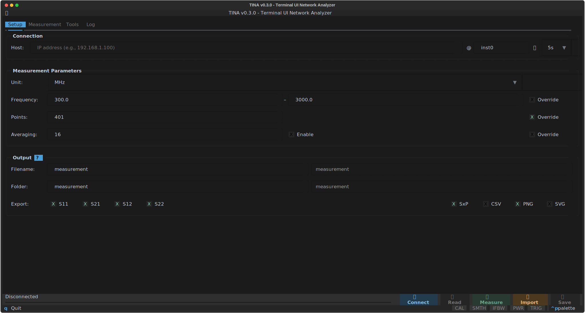
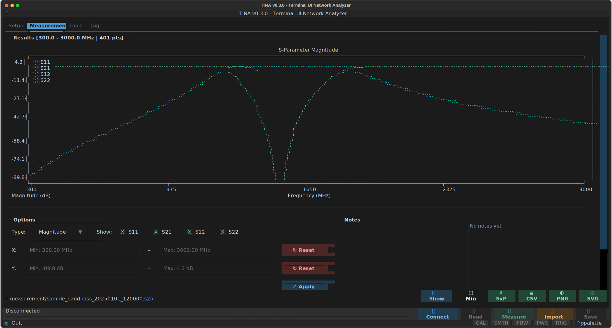
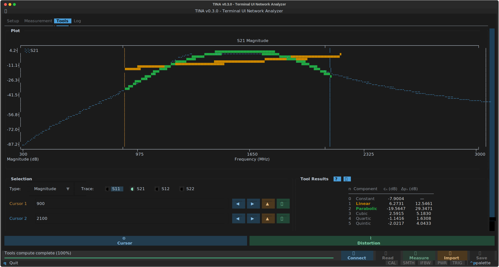
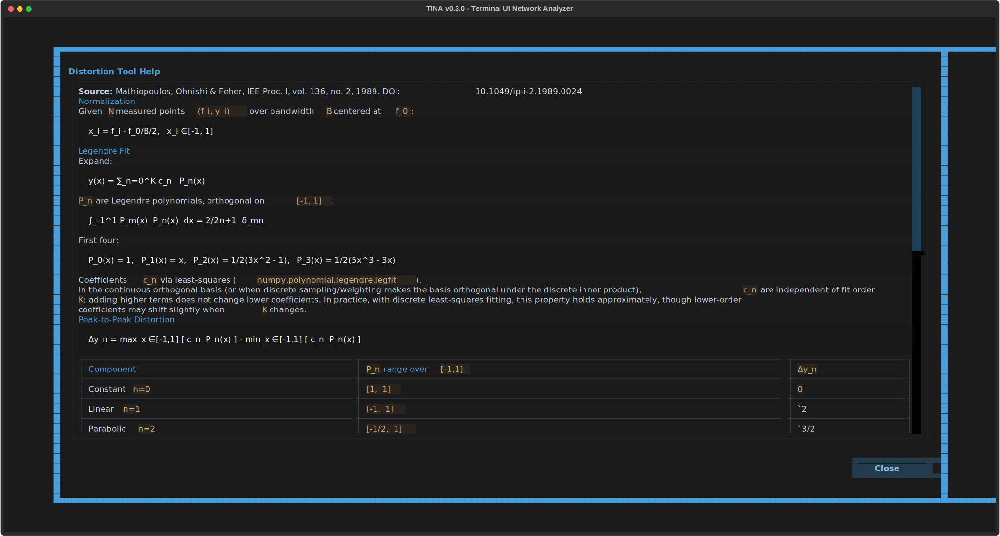
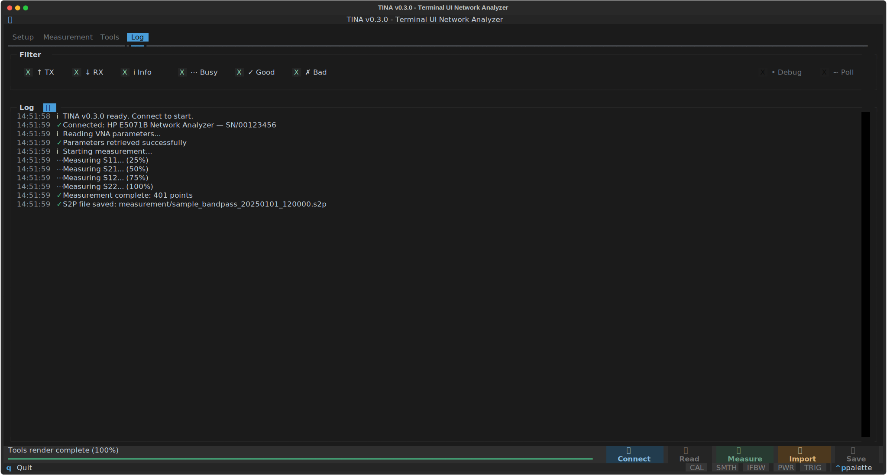

# TINA - Terminal UI Network Analyzer

Terminal-based VNA control with **dynamic driver discovery**.



## Overview

TINA is a TUI application for controlling Vector Network Analyzers over LAN/GPIB. It handles the full measurement workflow — connection, configuration, measurement, export, and analysis — entirely from the terminal.

### Measurement tab

Configure the VNA, trigger measurements, and view S-parameter plots in real time. Supports magnitude, phase, and Smith chart views with adjustable frequency and amplitude axis limits. Results are exported as Touchstone `.s2p` files with configurable output folder and filename.



### Tools tab

Analyse the last measurement without reconnecting. Two tools are available:

**Cursor** — place two frequency markers on any S-parameter trace and read off values and the delta between them.

**Distortion** — fit a Legendre polynomial series to the selected trace over a user-defined frequency window and decompose the response into flatness (P₀), tilt (P₁), bow (P₂), and higher-order distortion components. Each component reports its peak-to-peak contribution in dB.



The built-in help popup explains the math behind each tool.



### Log tab

Full session log with per-level filtering. Tracks every SCPI exchange, connection event, measurement step, and file export. Useful for diagnosing instrument communication issues.



## Installation

### Option 1: Install via uv (Recommended)

```bash
# Install directly from GitHub repository
uv tool install git+https://github.com/MysteriousWolf/tui-vna

# Run the application
tina                # GUI mode
tina --now          # CLI quick measurement
```

**Why uv?** Faster startup, smaller footprint, automatic dependency management.

### Option 2: Pre-built Binaries

For systems without Python/uv, download standalone executables from [GitHub Releases](https://github.com/MysteriousWolf/tui-vna/releases):

**Full version** (includes TUI):

- **Windows**: `tina-v{VERSION}-windows-x86_64.exe`
- **Linux**: `tina-v{VERSION}-linux-x86_64`
- **macOS**: `tina-v{VERSION}-macos-x86_64`

**Quick version** (CLI only, faster startup):

- **Windows**: `tina-quick-v{VERSION}-windows-x86_64.exe`
- **Linux**: `tina-quick-v{VERSION}-linux-x86_64`
- **macOS**: `tina-quick-v{VERSION}-macos-x86_64`

Replace `v{VERSION}` with the release tag (e.g. `v0.2.1`). Pick the asset matching your platform from the Releases page.

Quick variants are optimized for scripting and automation. Run the full version at least once to configure connection settings, then use quick version for fast measurements without parameters.

Note: Binaries have larger size and slower startup compared to uv installation.

### Option 3: Install from Local Clone (Development)

```bash
# Clone and install
git clone https://github.com/MysteriousWolf/tui-vna
cd tui-vna
uv tool install .

# Run the application
tina                # GUI mode
tina --now          # CLI quick measurement
```

## Project Structure

```
src/tina/            # Main application package
├── config/          # Settings and constants
├── drivers/         # VNA drivers (auto-discovered!)
├── utils/           # Helper modules (colors, terminal, paths, touchstone)
├── gui/             # TUI resources
├── main.py          # Application entry point
└── worker.py        # Threaded measurement worker
scripts/             # Build configurations (PyInstaller)
res/                 # Resources (icons)
run_tina.py          # PyInstaller entry point stub
```

## Adding a New VNA Driver

Create `src/tina/drivers/your_vna.py`:

```python
from .base import VNABase, VNAConfig

class YourVNA(VNABase):
    driver_name = "Your VNA Model"

    @staticmethod
    def idn_matcher(idn_string: str) -> bool:
        return "your_model" in idn_string.lower()

    # Implement required methods...
```

**Done!** Auto-discovered on startup. See `src/tina/drivers/README.md`.

## Quick Start

**GUI:** Connect → Configure → Measure → View Results

**CLI:**

```bash
tina --now                              # Quick measure
tina --host 192.168.1.100 --points 201 # Custom params
```

## Configuration

- **Connection:** VNA IP + VISA port (default: `inst0`)
- **Measurement:** Frequency range, sweep points, averaging
- **Output:** Folder (`measurement/`), S-parameter selection

All constants in `src/tina/config/constants.py`.

## Architecture

- **Plugin System:** Drivers auto-discovered from `drivers/` folder
- **Auto-detection:** Connects, reads `*IDN?`, switches to matching driver
- **Modular:** Config, drivers, utils clearly separated
- **SCPI library:** Reusable commands in `drivers/scpi_commands.py`

Supported VNAs:

- HP/Agilent/Keysight E5071 series

## Python API

```python
from tina.drivers import VNAConfig, HPE5071B
from tina.utils import TouchstoneExporter

config = VNAConfig(host="192.168.1.100", start_freq_hz=10e6, stop_freq_hz=1500e6)
with HPE5071B(config) as vna:
    freqs, sparams = vna.perform_measurement()
    TouchstoneExporter().export(freqs, sparams, "measurement")
```

## Development

**Requirements:** Python 3.10+, PyVISA-py, Textual, NumPy, Matplotlib

**Structure:**

- `config/` - Constants and settings
- `drivers/` - VNA drivers with auto-discovery
- `utils/` - Colors, terminal, paths, touchstone
- `gui/` - TUI resources (CSS in `.tcss`)

## License

MIT

---

<sub>This project is developed with the assistance of LLMs.</sub>
